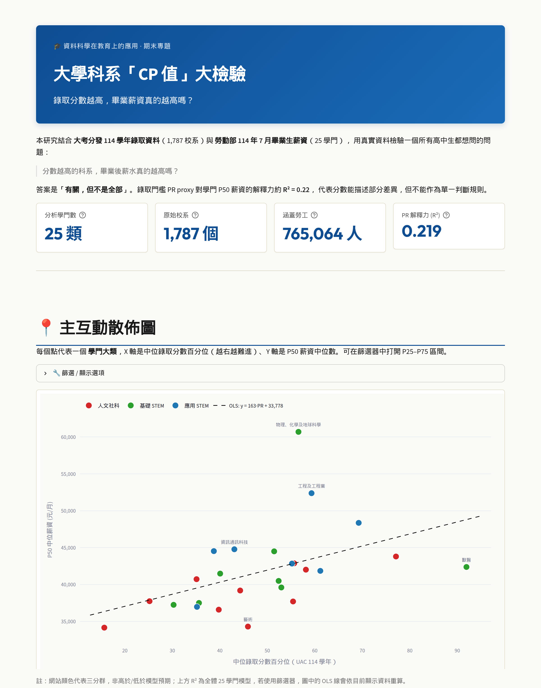

# Is my major worth it?

Interactive dashboard comparing admission scores with graduate salaries across 1,787 Taiwan university programs.



Does a higher admissions bar actually pay more after graduation? The app lines up the 2025 university placement results with Ministry of Labor graduate pay, and shows where each field sits relative to what the admission threshold alone would predict.

**Demo:** no public URL yet. [Run it locally](#run-locally) and open http://localhost:8501. This is a Streamlit server app, so GitHub Pages cannot host it.

## Questions it answers

- How much of the gap in median pay does the admission threshold explain? Across these 25 fields, about **R² = 0.22**.
- Which fields pay above or below that baseline (an OLS residual on median pay)?
- For a given university and department, which field it belongs to, and that field’s P25 / P50 / P75 monthly pay.
- Which fields have a tight pay band, and which have a wide one, using `(P75 − P25) / P50`.

## Data

| Piece | Source | Grain |
| --- | --- | --- |
| Admission results, academic year 114 (2025) | [University Entrance Committee, `114_result_school_data.pdf`](https://www.uac.edu.tw/114data/114_result_school_data.pdf) | 1,787 programs |
| Graduate pay, July 2025 (ROC 114/07) | [Ministry of Labor salary navigator](https://yoursalary.taiwanjobs.gov.tw/) (full-time pay by field, labor-pension contribution file) | 25 fields |
| Program → field crosswalk | [Ministry of Education `higher_bcode4.csv`](https://stats.moe.gov.tw/files/bcode/higher_bcode4.csv) (standard subject classification, 5th revision; 2016 bachelor daytime rows) | programs |

The horizontal axis is a proxy percentile: admission score divided by the weighted full mark, then ranked across programs. The PDF does not publish the College Entrance Examination Center’s official PR.

Public salary tables are released at field level. About 1,703 of the 1,787 programs match a field and can be looked up.

The admission PDF was parsed and the salary portal was scraped in a course working folder. This repository ships the dashboard, the joined tables in `data/`, `extract_quantiles.py` (P25/P50/P75 from the salary buckets), and `analysis_v2.py` (the field-level join and residual).

## Tech

Python 3.13 · Streamlit · Plotly · pandas · SciPy · scikit-learn

## Run locally

```bash
pip install -r requirements.txt
streamlit run app.py
```

Open http://localhost:8501. Five pages: overview, department lookup, field detail, pay spread, and methodology.

Course project at NTNU. Author: 王語揚. Advisor: 張維元.

## 中文說明

大學科系「CP 值」大檢驗：114 學年大考分發 1,787 個校系的錄取分數，對上勞動部 114 年 7 月 25 個學門的畢業生薪資，看分數能解釋多少薪資差異，以及哪些學門高於或低於模型預期。

作者：41111017E 王語揚 ・ 指導：張維元教授 ・ 課程：資料科學在教育上的應用

資料來源見上方表格（大考分發委員會錄取 PDF、勞動部薪資行情、教育部 `higher_bcode4.csv`）。PDF 解析與薪資頁面擷取在課程作業目錄完成；這個 repo 收錄互動網站與整理後的資料表。本機執行方式與英文區相同。
